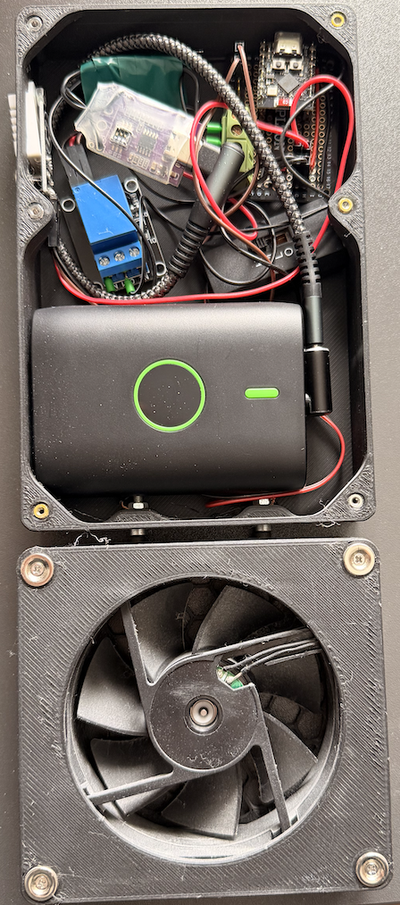
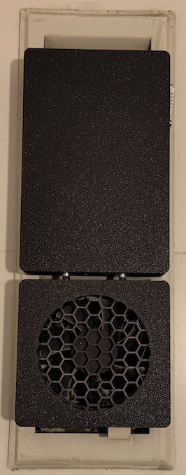

# 💨 Smart Steam Extractor

This project is an automated ventilation control system designed for my bathroom. The system monitors humidity levels and automatically activates a high-airflow fan to prevent condensation and mold growth.

## 🚀 The Engineering Behind It

While standard fans are often manual or timer-based, this system uses **threshold-based logic** powered by an ESP32-C3 to provide intelligent extraction.

### Technical Highlights:

* **ESP32-C3 Zero Integration:** High-performance control in an ultra-compact form factor.
* **Power Regulation:** The system utilizes an onboard **voltage regulator** to step down the 12V input from the power bank to the 5V required by the ESP32-C3, ensuring stable operation even during fan motor spikes.
* **Automatic Power Management:** By using a standard USB power bank, the system leverages the bank's internal BMS (Battery Management System). It provides a "natural" auto-cutoff when the battery is depleted, protecting the cells from deep discharge.
* **Sensor-Driven Logic:** A digital humidity sensor provides real-time environmental data. The fan is triggered via a switching circuit as soon as a specific humidity delta or threshold is reached.
* **3D-Printed Modular Enclosure:** The housing is split into two parts: a control box for the electronics and a dedicated fan unit with a custom hexagonal grill for optimized airflow and safety.

## 🛠️ Features

* **Auto-Ventilation:** Automatic activation when steam levels rise.
* **Hysteresis Logic:** Prevents "relay-chatter" by using different setpoints for switching on and off (e.g., ON at 70% RH, OFF only after dropping below 60% RH).
* **Status Monitoring:** Visual feedback provided by the onboard LED and the power bank's charge indicator.
* **Zero-Installation Design:** Battery-powered and compact, allowing it to be mounted on existing vents without needing 230V mains wiring.

## 📁 Project Structure & Source Code Note

> [!IMPORTANT]  
> **Source Code Availability:** Due to a recent computer migration, the original MicroPython source files (`main.py`, `boot.py`) were unfortunately lost. The project currently exists as a "black box" functional unit. This loss has accelerated the decision to move toward a more robust C++ implementation.

* **`CAD/`**: STL files for the 3D-printed control box and hexagonal fan guard.

## 🔧 Technical Stack

* **Controller:** ESP32-C3 Zero
* **Sensor:** Digital Humidity & Temperature Sensor (DHT series)
* **Actuator:** 12V Fan
* **Power:** USB Powerbank (12V) with integrated voltage regulation for the MCU.
* **Language:** MicroPython (Legacy) / **C++ (Planned)**
* **Status:** Functional Prototype (currently in daily use).

## 📅 Roadmap / Future Plans

* **Firmware Migration:** I am planning to rewrite the entire logic in **C++ (PlatformIO)**. This transition will fix the missing source code issue and allow for better performance and alignment with my other industrial-style projects.
* **Deep Sleep Implementation:** Utilizing the ESP32-C3’s deep sleep modes in C++ to significantly extend battery life between charges.
* **Custom PCB:** Moving from a breadboard/wire-nest setup to a custom-designed PCB to make the internal layout cleaner and more vibration-resistant.
